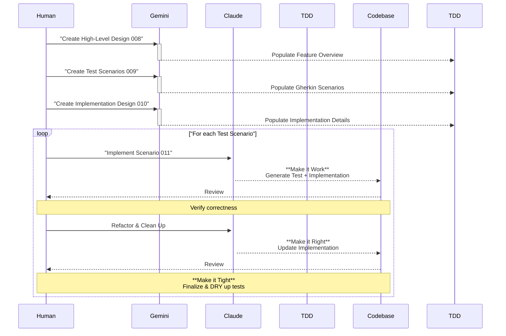

# An Approach to Building with AI

I have spent more time than I want to admit trying to figure out the best way to build an application with a large language model. I wanted a process that could take an idea from its initial form all the way through to a finished product. I definitely do not have everything perfect yet, but the workflow I have developed seems to be working out really well.

I'll admit, I was hesitant at first. As a big stickler for clean code, the idea of "vibing" seemed at odds with quality. But I realized that poor code only results from passively accepting AI output. The key was to maintain 100% control over the design and execution, even with AI assistance.

This document outlines the structured workflow I've developed to do just that. It's a process born from realizing that the best way to leverage AI is to apply the timeless principles of software engineering—thoughtful design, breaking down tasks, and rigorous testing—while letting the model handle the keystrokes. I have spent more time than I want to admit trying to figure out this process, but the workflow I have developed seems to be working out really well.

The core idea is to combine thoughtful design with the power of AI, creating a structured process that produces quality code. This is my journey so far.

```mermaid
sequenceDiagram
    participant Human
    participant Gemini
    participant Claude
    participant DesignDocs
    participant Codebase

    Human->>+Gemini: Brainstorm Idea and Research
    Gemini-->>-Human: Summaries and Analysis

    loop Foundational Design
        Human->>+Gemini: Generate Design Document
        Gemini-->>DesignDocs: Create/Update Doc
        DesignDocs-->>-Human: Review
    end

    Human->>+Gemini: Generate Feature Overview
    Gemini-->>-DesignDocs: Create features-overview.md

    loop For each Feature
        Human->>+Claude: Implement Feature
        Claude-->>Codebase: Write Code and Tests
        Codebase-->>-Human: Review and Refine
    end
```

## The Spark of an Idea

When I have a new idea, I start by having a conversation with an AI assistant. For this initial creative and design phase, I use Google's Gemini models. I do this away from the computer, while doing things around the house. I think about the overall design, the features, the structure, and how I want it to operate.

Once I have this general information, I move to my computer. I ask the assistant to create a summary of our conversation. This document captures what is being built, the problem it is solving, and the features that make it unique.

## Building the Foundation

With that summary in hand, I use Gemini deep research. I have it perform market analysis, look for competitors, and help me clearly define what makes the application special.

The output from this research is then combined with the original summary. This combined document becomes the foundation for the entire project. It is the source of truth that I will reference as I answer more questions and build out the design.

## Designing with Intention: The Workflow

From here, I begin to work through a series of structured design documents. To keep this process consistent, I use a set of standardized, reusable prompts that I run in a specific order. You can find all of these prompts in the [`workflows/V3/`](./workflows/V3/) directory. A key part of this process is assigning a specific role to the AI for each document. I have found that giving the LLM a persona to embody, such as a 'Senior Product Manager' or a 'Lead System Architect', results in higher quality and more contextually appropriate documentation.

The initial design phase creates six documents that form the foundation of the project. Each prompt has a specific purpose and persona:

- [`001-Project_Overview.md`](./workflows/V3/001-Project_Overview.md): **Role: Senior Product Manager.** This takes the initial research and formalizes it into a project overview, defining the vision, goals, and target audience.
- [`002-System_Architecture.md`](./workflows/V3/002-System_Architecture.md): **Role: Lead System Architect.** Outlines the high-level technical structure of the entire application.
- [`003-Data_Model.md`](./workflows/V3/003-Data_Model.md): **Role: Data Architect.** Describes the database schema and data relationships.
- [`004-Backend_Architecture.md`](./workflows/V3/004-Backend_Architecture.md): **Role: Senior Backend Architect.** Details the server-side components, APIs, and logic.
- [`005-Frontend_Architecture.md`](./workflows/V3/005-Frontend_Architecture.md): **Role: Senior Frontend Architect.** Details the client-side structure, components, and state management.
- [`006-ui-flows.md`](./workflows/V3/006-ui-flows.md): **Role: User Experience (UX) designer and architect.** Maps out the user's journey through the application.

What has been interesting is how this process echoes the way I used to work before agile development. It brings back a focus on thinking long and hard about the business context, the user experience, and the architecture. It allows me to pull from my architectural background to plan how the application should be built.

Once these first six workflow documents are complete, they serve as my design base. You can see examples of what these documents look like in the [`_docs/design/`](./_docs/design/) folder. The remaining prompts ([`007-feature-overview.md`](./workflows/V3/007-feature-overview.md) through [`011-feature-implementation.md`](./workflows/V3/011-feature-implementation.md)) then guide the iterative design, testing, and implementation of each individual feature.

## Planning the Features

Now that the design is established, the next step is to create a feature overview, much like you would during agile planning. This is guided by the [`007-feature-overview.md`](./workflows/V3/007-feature-overview.md) prompt, where the AI takes on the combined role of a **Senior Product Manager and Lead Architect**. I ask the AI assistant to analyze all the documents created so far, from the project overview to the UI flows.

From this analysis, it builds out the high-level features. This includes the feature name, a description, and the user stories. There are no implementation details at this stage. We are just building the skeleton, like you might do on a whiteboard with a team.

## Iterative Building: The Development Loop



With the features identified, the iterative building begins. I take one feature and its stories and work through a series of prompts to build out the detailed design before any code is written. This process is guided by the following prompts:

- [`008-high-level-design.md`](./workflows/V3/008-high-level-design.md): **Role: Senior Engineer and Architect.** This creates the initial technical design, outlining the feature's flow from a system perspective.
- [`009-test-scenario-design.md`](./workflows/V3/009-test-scenario-design.md): **Role: Senior Quality Assurance Engineer.** This adds comprehensive test scenarios in Gherkin to the design, covering happy paths, errors, and edge cases.
- [`010-implementation-design.md`](./workflows/V3/010-implementation-design.md): **Role: Senior Engineer and Architect.** This completes the technical design with specific implementation details, including types, function signatures, and pseudocode required to make the tests pass.

## The Art of Refinement

Now, it is time to write real code. For the coding itself, I switch to one of Anthropic's Claude models, as I find they excel at this part of the process. The implementation is guided by the final workflow prompt, [`011-feature-implementation.md`](./workflows/V3/011-feature-implementation.md), where the AI embodies a **Senior Full-Stack Engineer**.

The key here is to work in small, incremental batches, as this is paramount to success. I select only one or two test scenarios from the technical design and ask the AI to implement them. This approach keeps the amount of code I need to review small and manageable. This is also where the [`rules/`](./rules/) becomes very important, as they provide the AI with explicit instructions and constraints to follow during the build.

The flow follows the classic mantra: "Make it work, make it right, make it tight." This iterative loop is built on a foundation of testing, which provides the critical safety blanket needed when working with an AI.

1.  **Make it Work**: For a selected scenario, I have the AI generate both the test code and the implementation code at the same time. The immediate goal is simply to get a passing test. Since the high-level test logic was already defined in the Gherkin scenarios, I have confidence in the general direction. I don't worry about perfect code at this stage; getting a green test is the only priority.

2.  **Make it Right**: Once the initial code is working and the test is passing, I do a detailed review. I meticulously check both the generated test and the implementation to ensure they accurately reflect the requirements of the Gherkin scenario. After I've verified the code is correct, I can then ask the AI to refactor and clean up the _implementation_, using the now-verified test as a safety net. This is where I enforce code quality, instructing the AI to "Dry up the implementation according to the rules, but do not change the public interface."

3.  **Make it Tight**: Once the code is clean and the verified test is passing, the loop is complete for that scenario. I then confidently move on to the next one, repeating the process. After all the scenarios for a feature are implemented and working, I often do a final pass to refactor and dry up the test files themselves, ensuring the entire codebase remains clean and maintainable.

## The Power of Rules

When I first started this journey, the code I was getting from the AI was garbage. It didn't follow any patterns, was hard to follow, and didn't reflect the development principles I've honed over my career. The turning point was creating a comprehensive set of rule files.

These files are the guardrails for the AI. They provide explicit, granular instructions on everything from project structure and state management to accessibility and testing. By investing time in creating these rules, I started getting clean code that followed the development patterns I expect. They are the single most important component for ensuring quality and consistency.

Below is a list of the rules that guide my projects. Most are "Agent-Requested," meaning the AI is instructed to consult them based on the task, while some are "Automatic" and apply to all relevant files.

### Common Rules

- [`common-general-guidelines.md`](./rules/common/common-general-guidelines.md) (Automatic): General coding guidelines and best practices for the project.
- [`common-e2e-testing-guidelines.md`](./rules/common/common-e2e-testing-guidelines.md) (Agent-Requested): Comprehensive guidelines for writing maintainable and reliable Playwright tests.
- [`common-testing-guidelines.md`](./rules/common/common-testing-guidelines.md) (Agent-Requested): General testing guidelines for all test types and assertions.
- [`common-component-guidelines.md`](./rules/common/common-component-guidelines.md) (Agent-Requested): Common component guidelines for file structure, accessibility, required patterns, and anti-patterns.
- [`common-ui-project-structure.md`](./rules/common/common-ui-project-structure.md) (Agent-Requested): React-specific project structure and folder organization guidelines.
- [`common-form-management.md`](./rules/common/common-form-management.md) (Agent-Requested): Form handling, validation, and state management patterns.
- [`common-foundational-component-principles.md`](./rules/common/common-foundational-component-principles.md) (Agent-Requested): Apply when creating or modifying foundation-level UI components.
- [`common-styling-guidelines.md`](./rules/common/common-styling-guidelines.md) (Automatic): Guidelines for implementing scalable, maintainable styling with design tokens.
- [`common-typescript-guidelines.md`](./rules/common/common-typescript-guidelines.md) (Agent-Requested): TypeScript best practices, typing patterns, and strict checking configurations.
- [`common-ui-theme.md`](./rules/common/common-ui-theme.md) (Agent-Requested): Guidelines for UI theming and leveraging the theming system.
- [`common-data-store-architecture.md`](./rules/common/common-data-store-architecture.md) (Agent-Requested): Apply when implementing or modifying store architecture.
- [`common-firebase-integration.md`](./rules/common/common-firebase-integration.md) (Agent-Requested): Apply when implementing or modifying Firebase integration.

### Astro.js Rules

- [`astro-project-structure.md`](./rules/astro.js/astro-project-structure.md) (Agent-Requested): Astro and Solid.js project folder structure and conventions.
- [`astro-component-guidelines.md`](./rules/astro.js/astro-component-guidelines.md) (Agent-Requested): Apply when creating Astro components or island architecture.

### React Rules

- [`react-testing-guidelines.md`](./rules/react/react-testing-guidelines.md) (Agent-Requested): React-specific testing guidelines and best practices.
- [`react-component-guidelines.md`](./rules/react/react-component-guidelines.md) (Agent-Requested): React-specific rules for components, including state, hooks, and control flow.
- [`react-state-management.md`](./rules/react/react-state-management.md) (Agent-Requested): React state management using SWR for global state.

### Solid.js Rules

- [`solid-testing-guidelines.md`](./rules/solid.js/solid-testing-guidelines.md) (Agent-Requested): SolidJS-specific testing guidelines.
- [`solid-state-management.md`](./rules/solid.js/solid-state-management.md) (Agent-Requested): Apply when implementing component or application state in Solid.
- [`solidjs-component-guidelines.md`](./rules/solid.js/solidjs-component-guidelines.md) (Agent-Requested): SolidJS-specific rules for components.

## Why This Process Works

This deliberate, iterative process might not be as fast as giving an LLM a business problem and letting it code for hours, but the trade-off is well worth it. This workflow produces benefits that a single, massive prompt simply cannot match.

First, I get **exceptional documentation**. The design-first approach ensures that by the time I write code, I have a suite of documents that are accurate and reflect exactly what is being built.

Second, the emphasis on testing is a game-changer. I'll be honest, on my own projects, testing can sometimes take a backseat. This process forces a test-in-parallel approach. The result is more comprehensive test coverage than I've ever written myself, which gives me immense confidence when making changes.

Most importantly, **I remain in complete control**. I architected the system, I've reviewed every line of code, and I understand how it all works together. There's no black box. This process has even become a learning tool; I've picked up new coding techniques and tricks just by reviewing the AI's suggestions.

Finally, it leads to **higher quality, cleaner code**. We've all been there: you build a massive module in a flow state and know you should break it up, but the effort seems too high. This workflow removes that friction. It's easy to ask the AI to refactor and break things out, which helps me produce the clean, extensible code I strive for but might have skipped otherwise.

So, while it's not the fastest theoretical path, the end result is a high-quality solution that I deeply understand and can confidently maintain and extend.

## Final Thoughts & AI's Limitations

It's important to be realistic about the current state of AI in development. Models excel at boilerplate and UI layout, but for complex logic, they can fall short. They have a tendency to be additive; getting an AI to remove code or refactor elegantly can be a challenge. A lot of times, the best code is the code that isn't written—a concept AI struggles with. This workflow is designed to mitigate those weaknesses through rigorous testing and human-led design.

Does this mean we're losing the ability to write code ourselves? To some extent, yes. My mental energy has been redirected from syntax to architecture and strategy. But for building truly scalable and high-quality applications.
