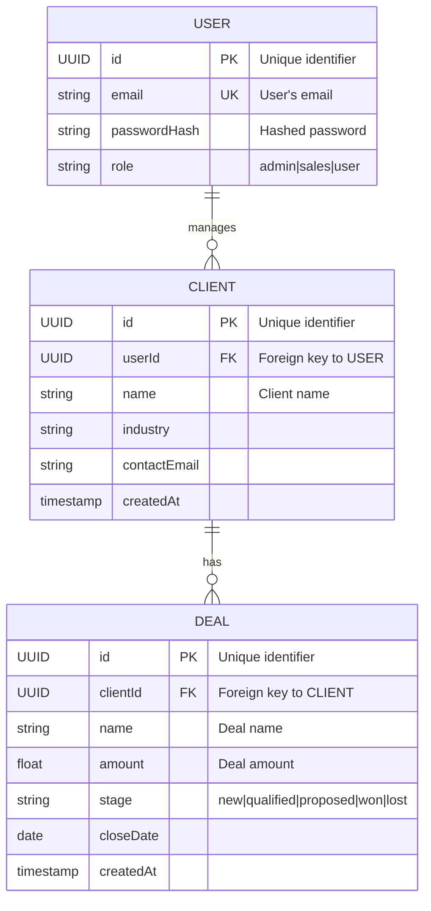

# Data Model Definitions

## 1. Conceptual Entity Relationships (Mermaid ERD)
A Mermaid ERD diagram showing the entities and their primary relationships (one-to-one, one-to-many, many-to-many). This provides a visual map.

## 2. Detailed Schema Definitions
For each entity, a table-like structure detailing fields, types, and constraints. This is the **explicit schema** for DB/ORM generation.

### 2.1. User Schema
| Field         | Type     | Constraints              | Description                               |
|---------------|----------|--------------------------|-------------------------------------------|
| id            | UUID     | PK, Auto-generated       | Unique user ID                            |
| email         | String   | Unique, Valid Email, Max 255 | User's login email address                |
| passwordHash  | String   | Required, Min 60 chars (BCrypt) | Hashed password                           |
| role          | Enum     | 'admin', 'sales', 'user' | User's role for permissions               |
| createdAt     | DateTime | Auto-generated           | Timestamp of user creation                |
| updatedAt     | DateTime | Auto-updated             | Timestamp of last update                  |

### 2.2. Client Schema
| Field         | Type      | Constraints                   | Description                               |
|---------------|-----------|-------------------------------|-------------------------------------------|
| id            | UUID      | PK, Auto-generated            | Unique client ID                          |
| userId        | UUID      | FK (to USER.id), Required     | Foreign key to USER                       |
| name          | String    | Required, Max 255             | Client name                               |
| industry      | String    | Optional, Max 100             | Client's industry                         |
| contactEmail  | String    | Optional, Valid Email, Max 255| Client's contact email                    |
| createdAt     | Timestamp | Auto-generated                | Timestamp of client creation              |
| updatedAt     | Timestamp | Auto-updated                  | Timestamp of last update                  |

### 2.3. Deal Schema
| Field         | Type      | Constraints                               | Description                               |
|---------------|-----------|-------------------------------------------|-------------------------------------------|
| id            | UUID      | PK, Auto-generated                        | Unique deal ID                            |
| clientId      | UUID      | FK (to CLIENT.id), Required               | Foreign key to CLIENT                     |
| name          | String    | Required, Max 255                         | Deal name                                 |
| amount        | Float     | Required, Min 0                           | Deal amount                               |
| stage         | Enum      | 'new', 'qualified', 'proposed', 'won', 'lost' | Current stage of the deal                 |
| closeDate     | Date      | Optional                                  | Expected or actual closing date           |
| createdAt     | Timestamp | Auto-generated                            | Timestamp of deal creation                |
| updatedAt     | Timestamp | Auto-updated                              | Timestamp of last update                  |

## 3. Enumerations & Lookup Values
Define all fixed lists of values used in the schemas.
### 3.1. UserRoleEnum: admin, sales, user
### 3.2. DealStageEnum: new, qualified, proposed, won, lost
