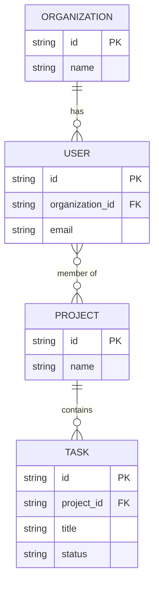

# Data Model

**Purpose**: This document details the logical and physical data models for the application, including entities, their attributes, relationships, and any constraints. It serves as the single source of truth for the application's data structure.

## 1. Core Entities

List the primary data entities that form the backbone of your application's domain.

**Format**:

- **[Entity Name]**: [A brief, one-sentence description of the entity's purpose]

**Example**:

- **User**: Represents an individual with an account who can log in and access the system.
- **Organization**: Represents a company or team that users belong to.
- **Project**: Represents a container for tasks and resources within an organization.
- **Task**: Represents a single unit of work to be completed within a project.

## 2. Entity Schema Definitions

Provide a detailed breakdown of the attributes for each entity, including data types, constraints, and descriptions.

**Format**:

### [Entity Name]

| Attribute Name     | Data Type     | Constraints                             | Description                               |
| ------------------ | ------------- | --------------------------------------- | ----------------------------------------- |
| `id`               | `UUID`        | Primary Key, Not Null                   | Unique identifier for the entity.         |
| `[attribute_name]` | `[data_type]` | `[e.g., Not Null, Unique, Foreign Key]` | `[Purpose of the attribute]`              |
| `created_at`       | `Timestamp`   | Not Null                                | Timestamp of when the record was created. |
| `updated_at`       | `Timestamp`   | Not Null                                | Timestamp of the last update.             |

**Example**:

### Task

| Attribute Name | Data Type                             | Constraints                        | Description                               |
| -------------- | ------------------------------------- | ---------------------------------- | ----------------------------------------- |
| `id`           | `UUID`                                | Primary Key, Not Null              | Unique identifier for the task.           |
| `project_id`   | `UUID`                                | Foreign Key (Project.id), Not Null | The project this task belongs to.         |
| `title`        | `String(255)`                         | Not Null                           | The title or name of the task.            |
| `status`       | `Enum('todo', 'in-progress', 'done')` | Not Null, Default: 'todo'          | The current status of the task.           |
| `due_date`     | `Date`                                | Nullable                           | The target completion date for the task.  |
| `created_at`   | `Timestamp`                           | Not Null                           | Timestamp of when the record was created. |
| `updated_at`   | `Timestamp`                           | Not Null                           | Timestamp of the last update.             |

## 3. Entity-Relationship Diagram (ERD)

Provide a diagram illustrating the entities and their relationships. Use Mermaid syntax for a text-based, renderable diagram. Only provide the keys needed for the entity relationships. Do not duplicate the attributes from the table above.

**Example (Mermaid Syntax)**:



## 4. Logical Data Models (Types/Interfaces)

Define key data structures that are not directly persisted as tables but are crucial for application logic, such as API payloads, DTOs (Data Transfer Objects), or complex objects passed between functions.

**Format**: Use TypeScript interface syntax to define the shape of the data.

**Example**:

### API & Function Data Structures

```typescript
// Payload for creating a new task via an API call
export type CreateTaskPayload = {
  projectId: string
  title: string
  description?: string
  assigneeId?: string
}

// The shape of a hydrated Task object used within the application
export type TaskView = {
  id: string
  title: string
  status: 'todo' | 'in-progress' | 'done'
  dueDate: Date | null
  assignee: {
    id: string
    name: string
  } | null
  project: {
    id: string
    name: string
  }
}
```

---

## Guiding Questions

Before finalizing the data model, ensure these questions are addressed:

### Data Integrity & Validation

1. What are the business rules and constraints for each entity's attributes (e.g., minimum/maximum length, value ranges, formats)?
2. How will you enforce uniqueness for key attributes like usernames or email addresses?
3. What is the strategy for handling optional vs. required fields?
4. How will you manage cascading deletes or updates when related records are modified?

### Query Patterns & Performance

5. What are the most frequent read operations (e.g., "get all tasks for a project," "find a user by email")?
6. What are the most frequent write operations?
7. Which fields will require indexes to ensure efficient query performance?
8. Will you need to support full-text search on any fields?

### Data Security & Privacy

9. Does the model contain any Personally Identifiable Information (PII) or other sensitive data?
10. What is the strategy for encrypting sensitive data at rest?
11. How does the data model support authorization (e.g., which user roles can access/modify which data)?

### Scalability & Evolution

12. How will the data model accommodate future growth in data volume?
13. Is the schema flexible enough to support anticipated future features without major refactoring?
14. What is the strategy for handling schema migrations and updates in a live environment?

### Data Lifecycle

15. Is there a data retention policy? How will old or inactive data be archived or purged?
16. How will you handle "soft deletes" versus permanent deletion of records?
