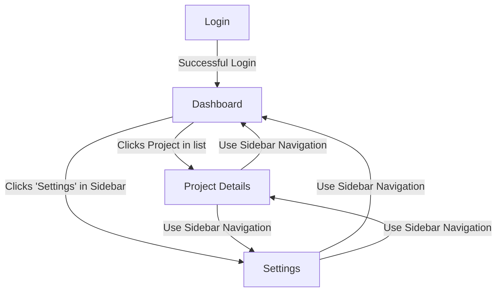

# UI Design & User Flow Overview

**Purpose**: This document provides a high-level overview of the application's user flow, pages, and screen-to-screen navigation. It serves as the entry point for understanding the user experience.

**Related Documents**:

- `../Frontend_Architecture.md`: The technical implementation details of the frontend.
- `../Project_Overview.md`: The "why" behind the application.

---

## 1. Page & Screen Inventory

This section provides a high-level summary of all pages.

| Page/Screen Name    | Route               | Description                                                                | Details Link                           |
| ------------------- | ------------------- | -------------------------------------------------------------------------- | -------------------------------------- |
| **Login**           | `/login`            | Allows existing users to authenticate.                                     | [View Details](./01-Login.md)          |
| **Dashboard**       | `/dashboard`        | The main landing page after login, showing an overview of key information. | [View Details](./02-Dashboard.md)      |
| **Project Details** | `/projects/:id`     | Displays all information related to a single project, including tasks.     | [View Details](./03-ProjectDetails.md) |
| **Settings**        | `/settings/profile` | Allows users to manage their profile information and application settings. | [View Details](./04-Settings.md)       |

---

## 2. Screen Flow Diagram

This diagram illustrates the primary navigation paths between the application's main screens.

