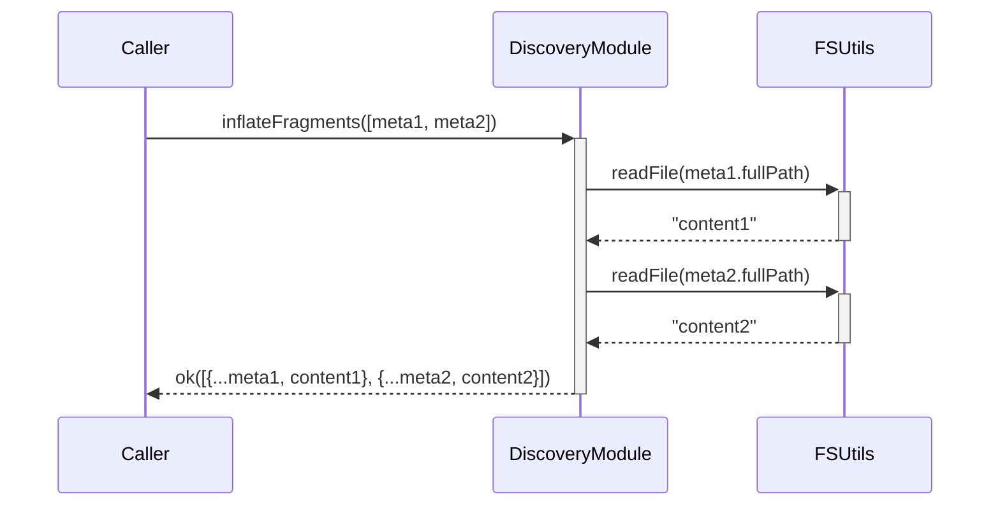

# Feature: [Feature Name] - Technical Design

**Purpose**: This document provides the detailed technical specifications for the [Feature Name] feature. It includes a technical overview, implementation details for all affected modules and types, and comprehensive test scenarios.

## 1. Feature Overview

Provide a 1-2 paragraph summary of the feature's technical implementation. Describe the new components/functions, their interactions, and the overall goal from an engineering perspective.

**Example**:
This feature introduces a utility function to "inflate" data objects with content from the file system. It involves creating a new public method, `inflateData`, which takes an array of metadata objects, reads the content of each associated file, and returns an array of enriched objects containing both the original metadata and the file content.

## 2. System / User Flow

Illustrate the flow of data or the sequence of events for this feature. Use a Mermaid diagram for clarity.

**Example**:



## 3. Implementation Details

Detail all new or updated types, functions, and modules required to implement this feature. Use pseudocode or type definitions to clarify structures and logic.

#### 3.1. New/Updated Types (`[path/to/types.ts]`)

1.  **`[NewTypeName]` Type:**
    - **Purpose**: [Briefly describe the purpose of this type]
    - **Structure**:
      ```typescript
      // Use TypeScript or pseudocode to define the type
      export type [NewTypeName] = {
        id: string;
        // ... other properties
      };
      ```

#### 3.2. `[ModuleName]` Module (`[path/to/module.ts]`)

- **Status**: [New | Existing]
- **New/Updated Function**:

  - **`[functionName]([parameters]): [ReturnType]`**

    - **Purpose**: [Describe what this function does, its inputs, and its outputs.]
    - **Implementation Details (Pseudocode)**:

      ```pseudocode
      FUNCTION [functionName](parameters):
        INITIALIZE empty list: results

        FOR EACH item IN parameters:
          // Describe the core logic, including calls to other utils/services
          INVOKE otherUtil.doSomething WITH item.property
          IF operation FAILED, THEN
            RETURN error
          END IF
          ADD result to results list
        END FOR

        RETURN ok(results)
      END FUNCTION
      ```

    - **Error Handling**: [Describe the error handling strategy, e.g., "Uses a Result type, propagating any errors from dependencies."]

## 4. Change Summary Table

Summarize all planned changes in a table for a clear, at-a-glance overview.

| Module/File Path      | Item Name        | Status                    | Description                                  |
| :-------------------- | :--------------- | :------------------------ | :------------------------------------------- |
| `[path/to/types.ts]`  | `[TypeName]`     | `[New/Updated/Unchanged]` | `[Brief description of the change]`          |
| `[path/to/module.ts]` | `[functionName]` | `[New/Updated/Unchanged]` | `[Brief description of the function's role]` |

## 5. Test Scenarios (Gherkin)

Outline the test scenarios for the new logic, focusing on both happy paths and error conditions.

```gherkin
Feature: [Feature Name]

  #---------------------------------------------------------------------------
  # Module: [ModuleName]
  # Function: [functionName]
  #---------------------------------------------------------------------------

  @happyPath
  Scenario: Successfully process a single valid item
    Given a valid input item
    And all external dependencies (e.g., file system) are working correctly
    When "[functionName]" is called with the item
    Then the function should return a success result
    And the result should contain the correctly processed data

  @happyPath
  Scenario: Successfully handle an empty input array
    Given an empty array of items
    When "[functionName]" is called with the empty array
    Then the function should return a success result
    And the result should be an empty array

  @errorPath
  Scenario: Fail gracefully if a dependency fails
    Given an input item that relies on a dependency
    And the dependency is mocked to return an error
    When "[functionName]" is called with the item
    Then the function should return an error result
    And the error should clearly indicate the source of the failure
```

---

## Guiding Questions

1.  **Dependencies**: Are there any non-obvious dependencies between this feature and other modules?
2.  **Error Propagation**: How will errors from dependencies be mapped or transformed before being returned by the new functions?
3.  **Performance**: Are there any performance considerations for batch operations? Should processing happen in parallel or sequentially?
4.  **Configuration**: Does this feature require any new configuration variables (e.g., in `config.ts`)?
5.  **Extensibility**: How might this feature need to evolve? Is the proposed design flexible enough to accommodate future requirements?
