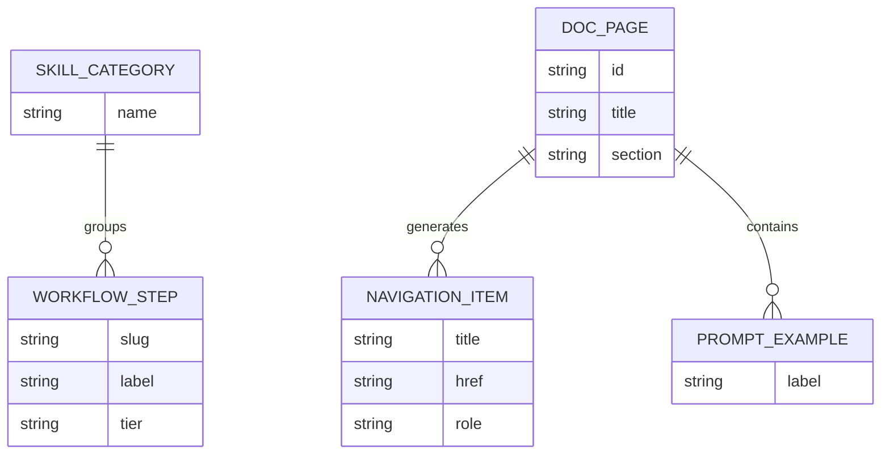

# Common Data Model

**Purpose**: This document defines the conceptual entities of the SpecFlow documentation site. It describes the content and navigation concepts the site works with, not storage or implementation details.

---

## Entity Index

| Entity | Type | Description |
|--------|------|-------------|
| `DocPage` | First-class entity | A published documentation page with body content and navigation metadata |
| `WorkflowStep` | First-class entity | A skill or workflow shown as part of the core path or broader catalog |
| `SkillCategory` | First-class entity | A grouped section of the full skill catalog |
| `PromptExample` | Value object | A reusable example prompt or invocation sequence shown inside a page |
| `NavigationItem` | Value object | A linkable item used in top navigation, sidebars, breadcrumbs, or prev/next navigation |

---

## Entity Definitions

### DocPage

> A content page that can be rendered into the documentation site.

**Attributes**:

| Attribute | Type | Required | Sensitive | Description |
|-----------|------|----------|-----------|-------------|
| `id` | Identifier | Yes | — | Stable route identity for the page |
| `title` | String | Yes | — | Page title used in the route and navigation |
| `description` | String | Yes | — | Short summary used in metadata and page headers |
| `section` | Enum | Yes | — | High-level grouping such as getting started, examples, or FAQ |
| `order` | Number | Yes | — | Relative ordering within a section |
| `navTitle` | String | No | — | Shorter label for sidebar or breadcrumb display |
| `body` | Rich text | Yes | — | Main page content |

**Relationships**:

| Related Entity | Cardinality | Description |
|----------------|-------------|-------------|
| `NavigationItem` | one-to-many | A page can generate multiple navigation representations |
| `PromptExample` | zero-to-many | A page may contain one or more example prompts |

### WorkflowStep

> A named workflow or skill that the site explains.

**Attributes**:

| Attribute | Type | Required | Sensitive | Description |
|-----------|------|----------|-----------|-------------|
| `slug` | Identifier | Yes | — | Stable programmatic name |
| `label` | String | Yes | — | User-facing skill name |
| `purpose` | String | Yes | — | One-line explanation of what it does |
| `whenToUse` | String | Yes | — | Guidance on the right invocation moment |
| `tier` | Enum | Yes | — | Core, optional, or bonus |
| `category` | Reference | Yes | — | The catalog grouping it belongs to |

**Relationships**:

| Related Entity | Cardinality | Description |
|----------------|-------------|-------------|
| `SkillCategory` | many-to-one | Each workflow step belongs to one catalog category |

### SkillCategory

> A customer-facing grouping of related skills.

**Attributes**:

| Attribute | Type | Required | Sensitive | Description |
|-----------|------|----------|-----------|-------------|
| `name` | String | Yes | — | Display name for the category |
| `summary` | String | No | — | Short explanation of what the group covers |

**Relationships**:

| Related Entity | Cardinality | Description |
|----------------|-------------|-------------|
| `WorkflowStep` | one-to-many | A category groups multiple workflow steps |

### PromptExample

> A reusable prompt or invocation sample displayed within a page.

**Attributes**:

| Attribute | Type | Required | Sensitive | Description |
|-----------|------|----------|-----------|-------------|
| `label` | String | Yes | — | Short identifier shown above the example |
| `text` | String | Yes | — | Example prompt body |

### NavigationItem

> A linkable navigation representation derived from a page or workflow entry.

**Attributes**:

| Attribute | Type | Required | Sensitive | Description |
|-----------|------|----------|-----------|-------------|
| `title` | String | Yes | — | Display text for the link |
| `href` | String | Yes | — | Target URL |
| `role` | Enum | Yes | — | Top nav, sidebar, breadcrumb, or previous/next |

---

## Entity-Relationship Diagram

---

## Business Rules

- **DocPage**: Every published page belongs to exactly one top-level section and has a deterministic order within that section.
- **WorkflowStep**: Every skill entry must declare whether it is core, optional, or bonus.
- **NavigationItem**: Every navigation item must resolve to a published page or a valid external destination.
- **Cross-entity**: The homepage, getting started flow, and core workflow pages must agree on the minimal path sequence.

---

## Open Questions

- [ ] Whether a future search index should become an explicit entity in the model.
- [ ] Whether contributor-only pages should remain first-class `DocPage` entries or move into a separate collection.
