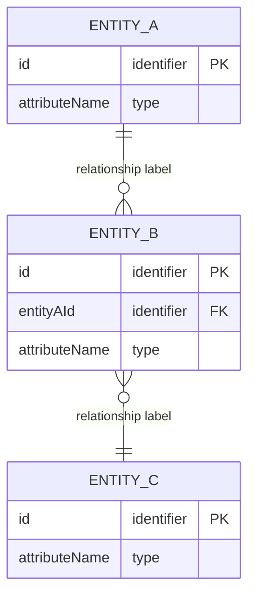

<!--
INSTRUCTION BLOCK — remove before committing

This template is filled in by the 103-common-data-model skill. Each section maps to a step in
the workflow. Populate every section with specific content. Do not leave placeholder labels
as-is — replace them with real entity names, attributes, and rules.

Guidelines:
- Document every entity exactly once. Do not reorganize the document by storage tier.
- If an entity has a storage context (client-only, server-only), note it as a one-line
  annotation on that entity — not as a section heading.
- Attributes should be described at the domain level: name, logical type, required/optional,
  and purpose. Do not use database column syntax, ORM annotations, or framework-specific types.
- Business rules are domain truths, not schema constraints. "A project must have at least one
  owner" is a business rule. "project_id NOT NULL" is not.
- The ERD shows all entities and relationships. Include cardinality. Keep it focused on
  relationships — do not repeat every attribute from the entity definitions.

Remove this instruction block when the document is complete.
-->

# Common Data Model

**Purpose**: This document defines the domain entities of the application — what they are, what
they carry, how they relate, and what rules govern them. It is the single authoritative reference
for the application's domain concepts, written independently of implementation. Downstream
documents (backend architecture, API design, frontend state, data access patterns) align to this
model.

---

## Entity Index

| Entity | Type | Description |
|--------|------|-------------|
| `EntityName` | First-class entity / Value object / Enum | One-sentence purpose |

> **Entity types**: Use *first-class entity* for domain objects with independent identity (they
> can be created, retrieved, and referenced on their own). Use *value object* for objects defined
> entirely by their attributes with no independent identity (e.g., `Address`). Use *enum* for
> fixed sets of named values.

---

## Entity Definitions

### EntityName

> *One sentence stating what this entity represents in the domain.*

**Storage context**: *(Optional — only include if non-obvious or constraining. Examples:
"Client-only: never persisted to the server." or "Server-only: never sent to the client.")*

**Lifecycle states**: *(Optional — list states and valid transitions if the entity moves through
a lifecycle. Example: Draft → Active → Archived)*

**Attributes**:

| Attribute | Type | Required | Sensitive | Description |
|-----------|------|----------|-----------|-------------|
| `id` | Identifier | Yes | — | Unique identity for the entity |
| `attributeName` | String / Number / Boolean / Date / Enum / Reference | Yes / No | Yes / — | What this attribute represents |

> **Sensitive attributes**: List any attributes containing PII, financial data, credentials, or
> other sensitive information. Note handling requirements (e.g., "exclude from logs", "encrypt
> at rest").

**Relationships**:

| Related Entity | Cardinality | Description |
|----------------|-------------|-------------|
| `OtherEntity` | one-to-many / many-to-many / etc. | How this entity relates to the other |

---

*(Repeat the EntityName section for each entity in the index)*

---

## Entity-Relationship Diagram

> Include all entities from the Entity Index. Label every relationship. Show cardinality using
> ERD notation (||, |o, }o, o{). Keep attribute lists here minimal — the entity definitions
> above are the authoritative attribute reference.

---

## Business Rules

> State rules at the domain level — truths a product manager and domain expert would recognize
> as correct regardless of how the system is built. Each rule should be a complete, testable
> statement.

- **[EntityName]**: Rule statement. (Example: "A project must have at least one owner at all times.")
- **[EntityName]**: Rule statement. (Example: "An order cannot be modified after it has been fulfilled.")
- **Cross-entity**: Rule statement. (Example: "A user may not be a member of more than one organization on the free plan.")

---

## Open Questions

> List domain questions that remain unresolved. Do not paper over uncertainty — name it
> explicitly so downstream work does not build on a false assumption.

- [ ] Question. (Example: "Is an email address required to be unique per organization, or globally across all organizations?")
- [ ] Question. (Example: "Does deleting a project cascade to its tasks, or are tasks archived?")
