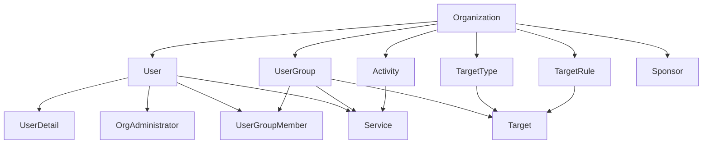

## Universal Setup Pattern

### For Tests with Database Connectivity (E2E, Integration, Unit with DB)

```typescript
// Standardized setUp function using TestContext
async function setUp(ctx: TestContext, testData: DataGenObject = {}) {
  const baseData = {
    orgs: [{ _id: 'O1' }],
    users: [{ _id: 'U1', orgId: 'O1' }],
    userDetails: [{ _id: 'U1' }],
  }

  const { selector, authUser } = await ctx.setupEnv(baseData, testData, page?, 'U1', loginFn?)
  const service = new SomeService(ctx.db)

  return { selector, authUser, service }
}

// Usage in tests
test('should perform action with authenticated user', async ({ ctx }) => {
  const { selector, authUser, service } = await setUp(ctx)
  // Test logic here
})
```

### For Unit Tests Without Database

```typescript
// Direct setup without TestContext
async function setUp(userOverrides = {}) {
  const user = generateUser(userOverrides)
  const validator = { validateUser }
  return { validator, user }
}

test('should validate user', async () => {
  const { validator, user } = await setUp()
  const result = validator.validateUser(user)
  expect(result.isValid).toBe(true)
})
```

## TestContext API Usage

### Initial Data Setup Through setupEnv

All initial test data setup must go through `ctx.setupEnv()`:

```typescript
// ✅ CORRECT - Initial data setup through setupEnv
const { selector, authUser } = await ctx.setupEnv(baseData, testData, page, 'U1', apiBasedLogin)

// ✅ ALSO CORRECT - Additional data creation during test execution
ctx.scenario.user({ userId: 'U2' }).rankingDetails({ title: 'Test', creatorId: 'U2' }).build().insert()

// ❌ WRONG - Never do initial data setup independently
// Don't use scenario/builder patterns for initial test setup
```

### Minimal Data Specification

Only specify data that is specific to or needed for the test:

```typescript
// ✅ CORRECT - Only specify IDs and relationships, let generators handle the rest
const baseData = {
  orgs: [{ _id: 'O1' }], // Only specify ID
  users: [{ _id: 'U1', orgId: 'O1' }], // Only specify ID and relationship
  userDetails: [{ _id: 'U1' }], // Only specify ID - generator creates name, email, etc.
}

// ❌ WRONG - Over-specifying data that generators can handle
const baseData = {
  orgs: [{ _id: 'O1', name: 'Test Organization', description: 'Test org' }], // Unnecessary
  users: [{ _id: 'U1', orgId: 'O1', userName: 'test@example.com' }], // Unnecessary
  userDetails: [{ _id: 'U1', firstName: 'John', lastName: 'Doe', email: 'john@example.com' }], // Unnecessary
}
```

### Environment Setup with Authentication

Use the `ctx.setupEnv()` method to create test data and handle authentication in one atomic operation.

```typescript
import { test } from '@e2e/fixtures'
import { apiBasedLogin } from '@e2e/utils/authentication'

// Standardized setUp function with TestContext
async function setUp(page: Page, ctx: TestContext, testData: DataGenObject = {}) {
  const baseData = {
    orgs: [{ _id: 'O1' }],
    users: [{ _id: 'U1', orgId: 'O1' }],
    userDetails: [{ _id: 'U1' }],
  }

  const { selector, authUser } = await ctx.setupEnv(baseData, testData, page, 'U1', apiBasedLogin)
  const dashboardPage = new DashboardPage(page)

  return { dashboardPage, authUser, selector }
}

test('should perform an action with authenticated user', async ({ page, ctx }) => {
  const { dashboardPage, authUser } = await setUp(page, ctx)

  // authUser is now logged in and available for assertions
  await dashboardPage.goto()
  await expect(page.getByText(authUser.firstName)).toBeVisible()
})
```

### Tests Without Authentication

If a test does not require authentication, omit the page and authShortId parameters:

```typescript
async function setUp(ctx: TestContext, testData: DataGenObject = {}) {
  const baseData = {
    orgs: [{ _id: 'O1' }],
    users: [{ _id: 'U1', orgId: 'O1' }],
    userDetails: [{ _id: 'U1' }],
  }

  const { selector } = await ctx.setupEnv(baseData, testData)
  const publicPage = new PublicPage(page)

  return { publicPage, selector }
}
```

## ID Conventions and Shorthand Mapping

All test data generation must use the TestContext's ID provider with standardized shorthand IDs. The following conventions are mandatory:

### Entity ID Conventions

- **O1, O2, O3...** - Organizations
- **U1, U2, U3...** - Users
- **G1, G2, G3...** - User Groups
- **A1, A2, A3...** - Activities
- **T1, T2, T3...** - Targets
- **S1, S2, S3...** - Services
- **R1, R2, R3...** - Target Rules
- **TT1, TT2, TT3...** - Target Types
- **SP1, SP2, SP3...** - Sponsors
- **REQ1, REQ2, REQ3...** - Requests

### Shorthand ID Resolution

Tests use shorthand IDs directly in selector methods without needing to know about the ID provider:

```typescript
// ✅ CORRECT - Use shorthand IDs in selector methods
const user = ctx.selector.getUser('U1')
const org = ctx.selector.getOrg('O1')
const userGroup = ctx.selector.getUserGroup('G1')

// ❌ WRONG - Don't access ID provider directly
const userId = ctx.scenario.ID('U1')
const user = ctx.selector.getUser(userId)
```

## Entity Relationship Map

Based on the data model, the following relationships must be maintained when creating test data:

### Core Entity Dependencies



### Required Relationships

1. **User → UserDetail**: Every user must have a corresponding user detail record
2. **User → Organization**: Users must belong to an organization
3. **UserGroup → Organization**: User groups must belong to an organization
4. **UserGroupMember → User + UserGroup**: Links users to groups with roles
5. **OrgAdministrator → User + Organization**: Defines admin roles within orgs
6. **Service → UserGroup + Activity + User**: Services must reference valid entities
7. **Target → TargetType + Reference**: Targets must have a type and reference entity
8. **TargetRule → Organization**: Rules belong to organizations
9. **Activity → Organization**: Activities belong to organizations

### Relationship Validation Patterns

```typescript
// Example: Creating a complete user with all required relationships
const MODULE_BASE_DATA = {
  orgs: [{ _id: 'O1' }],
  users: [{ _id: 'U1', orgId: 'O1' }],
  userDetails: [{ _id: 'U1' }],
  userGroups: [{ _id: 'G1', orgId: 'O1' }],
  userGroupMembers: [{ userId: 'U1', userGroupId: 'G1' }],
  orgAdmins: [{ userId: 'U1', orgId: 'O1' }],
  activities: [{ _id: 'A1', orgId: 'O1' }],
  targetTypes: [{ _id: 'TT1', orgId: 'O1' }],
}
```

## Module Base Data Pattern

```typescript
const MODULE_BASE_DATA = {
  orgs: [{ _id: 'O1' }],
  users: [{ _id: 'U1', orgId: 'O1' }],
  userDetails: [{ _id: 'U1' }],
}

async function setUp(ctx: TestContext, testData: DataGenObject = {}) {
  const { selector, authUser } = await ctx.setupEnv(MODULE_BASE_DATA, testData, page?, 'U1', loginFn?)
  return { selector, authUser }
}
```

## Test Data Setup Patterns

### Pattern 1: Minimal Setup with Required Dependencies

```typescript
// For tests that need basic user/org setup
const MODULE_BASE_DATA = {
  orgs: [{ _id: 'O1' }],
  users: [{ _id: 'U1', orgId: 'O1' }],
  userDetails: [{ _id: 'U1' }],
}

async function setUp(ctx: TestContext, testData: DataGenObject = {}) {
  const { selector, authUser } = await ctx.setupEnv(MODULE_BASE_DATA, testData, page?, 'U1', loginFn?)
  return { selector, authUser }
}
```

### Pattern 2: Complete User Group Setup

```typescript
// For tests involving user groups and members
const MODULE_BASE_DATA = {
  orgs: [{ _id: 'O1' }],
  users: [
    { _id: 'U1', orgId: 'O1' },
    { _id: 'U2', orgId: 'O1' },
  ],
  userDetails: [{ _id: 'U1' }, { _id: 'U2' }],
  userGroups: [{ _id: 'G1', orgId: 'O1' }],
  userGroupMembers: [
    { userId: 'U1', userGroupId: 'G1' },
    { userId: 'U2', userGroupId: 'G1' },
  ],
}

async function setUp(ctx: TestContext, testData: DataGenObject = {}) {
  const { selector, authUser } = await ctx.setupEnv(MODULE_BASE_DATA, testData, page?, 'U1', loginFn?)
  return { selector, authUser }
}
```

## Data Merging and Override Patterns

### ⚠️ CRITICAL: Avoiding Duplicate Key Violations

**NEVER override entities with the same shorthand ID as MODULE_BASE_DATA**. This creates duplicate key violations and test failures.

```typescript
// ❌ WRONG - Creates duplicate key violation for 'U1'
const MODULE_BASE_DATA = {
  orgs: [{ _id: 'O1' }],
  users: [{ _id: 'U1', orgId: 'O1' }],
  userDetails: [{ _id: 'U1' }],
}

test('Wrong approach', async () => {
  const { ctx } = await setupTest({
    users: [{ _id: 'U1', userName: 'custom@example.com' }], // ❌ Duplicates U1!
    userDetails: [{ _id: 'U1', email: 'custom@example.com' }], // ❌ Duplicates U1!
  })
})

// ✅ CORRECT - Use different shorthand IDs for test-specific data
test('Correct approach', async () => {
  const { ctx } = await setupTest({
    users: [{ _id: 'U2', userName: 'custom@example.com', orgId: 'O1' }], // ✅ New ID U2
    userDetails: [{ _id: 'U2', email: 'custom@example.com' }], // ✅ New ID U2
  })

  const user = ctx.selector.getUser('U2') // ✅ Access with correct ID
  expect(user.userName).toBe('custom@example.com')
})
```

### When Tests Don't Need Additional Data

If your test only needs the base data without modifications, pass empty testData:

```typescript
// ✅ EXCELLENT PATTERN - No additional data needed
async function setUp(ctx: TestContext) {
  const { selector, authUser } = await ctx.setupEnv(MODULE_BASE_DATA, {}, page?, 'U1', loginFn?)
  return { selector, authUser }
}

test('Simple test with base data only', async ({ ctx }) => {
  const { selector, authUser } = await setUp(ctx)
  const user = selector.getUser('U1')
  expect(user).toBeDefined()
})
```
