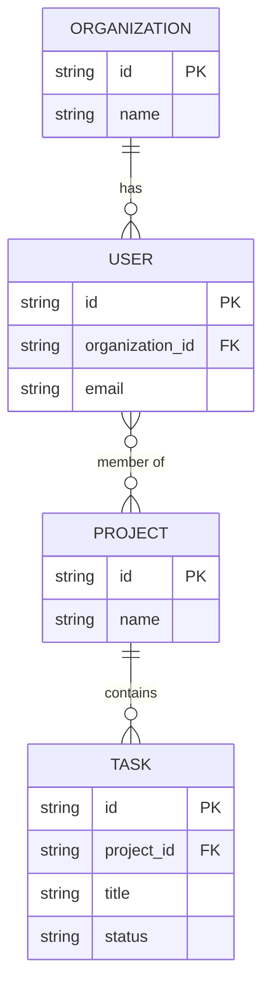

# 03 - Data Model Template

**Purpose**: This document details the persisted data model for the application, including entities, their attributes, relationships, and constraints. It focuses solely on the data structure and relationships independent of access patterns or user experience. This serves as the single source of truth for the application's persisted data structure.

## 1. Core Entities

[Define the primary data entities that form the backbone of your application's domain.]

**Format**:

- **[Entity Name]**: [A brief, one-sentence description of the entity's purpose]

**Example**:

- **User**: Represents an individual with an account who can log in and access the system
- **Organization**: Represents a company or team that users belong to
- **Project**: Represents a container for tasks and resources within an organization
- **Task**: Represents a single unit of work to be completed within a project

## 2. Entity Schema Definitions

[Provide detailed breakdown of attributes for each entity, including data types, constraints, and descriptions.]

**Format**:

### [Entity Name]

| Attribute Name     | Data Type     | Constraints                             | Description                              |
| ------------------ | ------------- | --------------------------------------- | ---------------------------------------- |
| `id`               | `UUID`        | Primary Key, Not Null                   | Unique identifier for the entity         |
| `[attribute_name]` | `[data_type]` | `[e.g., Not Null, Unique, Foreign Key]` | `[Purpose of the attribute]`             |
| `created_at`       | `Timestamp`   | Not Null                                | Timestamp of when the record was created |
| `updated_at`       | `Timestamp`   | Not Null                                | Timestamp of the last update             |

**Example**:

### Task

| Attribute Name | Data Type                             | Constraints                        | Description                              |
| -------------- | ------------------------------------- | ---------------------------------- | ---------------------------------------- |
| `id`           | `UUID`                                | Primary Key, Not Null              | Unique identifier for the task           |
| `project_id`   | `UUID`                                | Foreign Key (Project.id), Not Null | The project this task belongs to         |
| `title`        | `String(255)`                         | Not Null                           | The title or name of the task            |
| `status`       | `Enum('todo', 'in-progress', 'done')` | Not Null, Default: 'todo'          | The current status of the task           |
| `due_date`     | `Date`                                | Nullable                           | The target completion date for the task  |
| `created_at`   | `Timestamp`                           | Not Null                           | Timestamp of when the record was created |
| `updated_at`   | `Timestamp`                           | Not Null                           | Timestamp of the last update             |

## 3. Entity-Relationship Diagram (ERD)

[Provide a diagram illustrating entities and their relationships using Mermaid syntax. Only include keys needed for entity relationships, not all attributes from the tables above.]

**Example (Mermaid Syntax)**:

## 4. Data Constraints & Business Rules

[Define the business rules and constraints that govern data integrity and validation at the database level.]

**Format**:

- **Entity Constraints**: [Required fields, data type constraints, value ranges]
- **Relationship Constraints**: [Referential integrity rules, cascade behaviors]
- **Business Rules**: [Domain-specific validation rules enforced at data level]
- **Uniqueness Constraints**: [Fields that must be unique across entities]

**Example**:

- **Entity Constraints**: User email must be valid format, task status must be one of defined enum values
- **Relationship Constraints**: Tasks cannot exist without a project, users must belong to an organization
- **Business Rules**: Project names must be unique within an organization, task due dates cannot be in the past
- **Uniqueness Constraints**: User email unique across system, project name unique within organization

## 5. Data Integrity & Validation

[Define how data integrity is maintained and what validation occurs at the database level.]

**Format**:

- **Referential Integrity**: [How foreign key relationships are enforced]
- **Data Validation**: [Database-level validation rules and constraints]
- **Cascade Behaviors**: [What happens when related records are updated or deleted]
- **Check Constraints**: [Custom validation rules enforced at database level]

**Example**:

- **Referential Integrity**: Foreign key constraints prevent orphaned records, cascade delete removes related tasks when project is deleted
- **Data Validation**: Email format validation, date range constraints, enum value restrictions
- **Cascade Behaviors**: Delete project cascades to delete all tasks, update user email updates all references
- **Check Constraints**: Task due date must be after creation date, project start date must be before end date

## 6. Data Security & Privacy

[Define how sensitive data is protected and what privacy measures are implemented.]

**Format**:

- **Sensitive Data**: [What data requires special protection]
- **Encryption Strategy**: [How sensitive data is encrypted at rest and in transit]
- **Access Controls**: [Who can access what data and under what conditions]
- **Data Retention**: [How long data is kept and when it's purged]

**Example**:

- **Sensitive Data**: User passwords (hashed), personal information, payment data
- **Encryption Strategy**: AES-256 encryption at rest, TLS 1.3 in transit, bcrypt for passwords
- **Access Controls**: Role-based access control (RBAC) with project-level permissions
- **Data Retention**: User data retained for 7 years, inactive accounts purged after 2 years

## 7. Data Lifecycle & Schema Management

[Define how data evolves over time and how schema changes are managed.]

**Format**:

- **Schema Evolution**: [How database schema changes are managed in production]
- **Data Migration**: [Process for migrating existing data during schema changes]
- **Data Retention**: [How long different types of data are retained]
- **Data Archival**: [How old or inactive data is archived or purged]

**Example**:

- **Schema Evolution**: Versioned migrations with backward compatibility, feature flags for breaking changes
- **Data Migration**: Automated migration scripts with rollback procedures, zero-downtime deployments
- **Data Retention**: User data retained for 7 years, completed projects archived after 5 years
- **Data Archival**: Archive completed projects after 5 years, purge deleted records after 30 days
