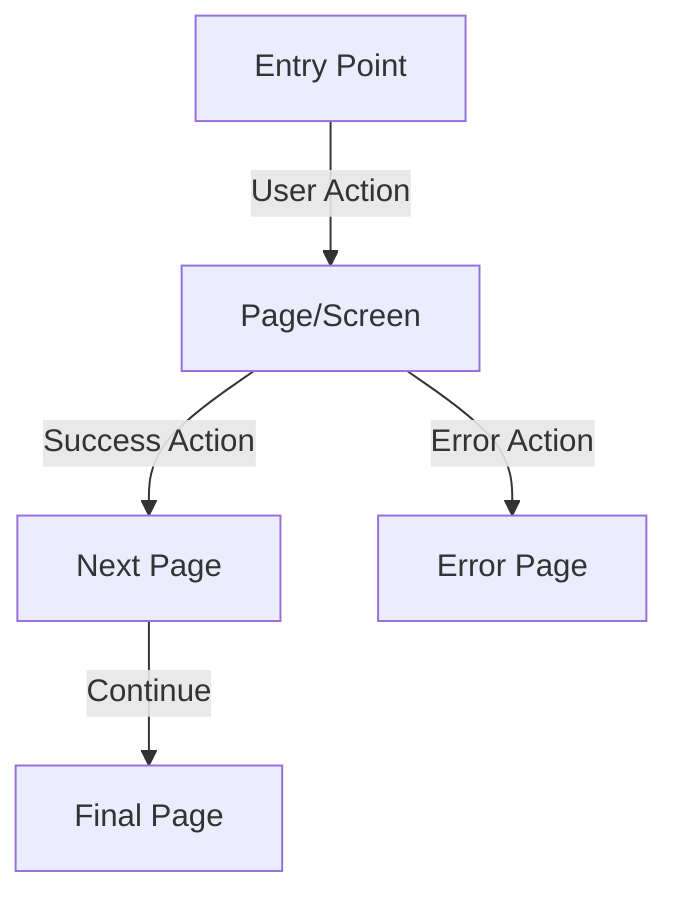

# 07 - UI Experience Overview

**Purpose**: This document establishes the comprehensive user experience architecture, navigation patterns, and user journey mapping for the application. It focuses on how users move through the application and how interfaces connect to support user goals.

## 1. Application Structure & User Roles

Define the overall application structure and how different user roles interact with the system.

**Format**:

### Application Overview

- **Primary Purpose**: [Core application purpose and main user goals]
- **Key User Roles**: [Primary user roles and their different access patterns]
- **Main Functional Areas**: [Core sections or areas of the application]

### User Role Definitions

- **Role Name**: [Description of user type and their primary goals]
- **Access Patterns**: [How this role typically enters and uses the application]
- **Key Tasks**: [Main tasks this role needs to accomplish]

## 2. Page & Screen Inventory

Document all pages/screens with their routes and purposes in a comprehensive table.

**Format**:

### Page Inventory Table

| Page/Screen Name                            | Route    | Description                                           | User Role Access                        |
| ------------------------------------------- | -------- | ----------------------------------------------------- | --------------------------------------- |
| [Page Name](./page-folder/page-overview.md) | `/route` | [Brief description of page purpose and functionality] | [Which user roles can access this page] |
| [Page Name](./page-folder/page-overview.md) | `/route` | [Brief description of page purpose and functionality] | [Which user roles can access this page] |

### Page Categories

- **Authentication Pages**: [Login, registration, password reset, etc.]
- **Main Application Pages**: [Core functionality pages]
- **Administrative Pages**: [Admin-only functionality]
- **Error Pages**: [404, 500, maintenance pages]
- **Utility Pages**: [Help, settings, profile pages]

## 3. Navigation Architecture

Define the navigation structure and patterns that guide users through the application.

**Format**:

### Primary Navigation

- **Navigation Philosophy**: [Approach to main navigation and user orientation]
- **Primary Navigation Elements**: [Main navigation components and their purposes]
- **Navigation Hierarchy**: [How navigation is organized and prioritized]

### Secondary Navigation

- **Contextual Navigation**: [Navigation that appears based on user context]
- **Breadcrumb Strategy**: [How users understand their current location]
- **Search and Discovery**: [How users find content and features]

### Mobile Navigation

- **Mobile Navigation Pattern**: [How navigation adapts for mobile devices]
- **Touch Optimization**: [Touch-friendly navigation considerations]
- **Gesture Support**: [Gesture-based navigation patterns]

## 4. Screen Flow Diagram

Create a visual representation of how users navigate between screens.

**Format**:

### Navigation Flow Diagram

### Flow Legend

- **Solid Lines**: Primary user flows
- **Dashed Lines**: Secondary or error flows
- **Labels**: Actions that trigger navigation
- **Colors**: Different user roles (if applicable)

## 5. User Journey Mapping

Map out the primary user journeys and how users accomplish their goals.

**Format**:

### Primary User Journeys

- **Journey Name**: [Name of the user journey]
- **User Goal**: [What the user is trying to accomplish]
- **Entry Point**: [How users typically start this journey]
- **Key Steps**: [Main steps in the journey]
- **Success Criteria**: [How users know they've completed their goal]
- **Pain Points**: [Potential challenges or friction points]

### Cross-Platform Journeys

- **Journey Continuity**: [How users move between devices and platforms]
- **Data Synchronization**: [How user data and progress sync across platforms]
- **Context Preservation**: [How user context is maintained across sessions]

## 6. Information Architecture

Define how content and features are organized and structured.

**Format**:

### Content Organization

- **Content Hierarchy**: [How information is organized and prioritized]
- **Content Categories**: [Main content types and their organization]
- **Content Relationships**: [How different content pieces relate to each other]

### Search and Discovery

- **Search Strategy**: [How users find content and features]
- **Filtering and Sorting**: [How users narrow down and organize content]
- **Recommendation System**: [How the system suggests relevant content]

### Content Presentation

- **Content Density**: [How much information is presented at once]
- **Progressive Disclosure**: [How complex information is revealed gradually]
- **Contextual Information**: [How additional information is provided when needed]

## 7. Interaction Patterns

Define the consistent interaction patterns used throughout the application.

**Format**:

### Core Interaction Patterns

- **Navigation Interactions**: [How users move between different areas]
- **Content Interactions**: [How users interact with content and data]
- **Form Interactions**: [How users input and modify information]
- **Feedback Interactions**: [How the system provides feedback to users]

### Accessibility Patterns

- **Keyboard Navigation**: [How users navigate using only the keyboard]
- **Screen Reader Support**: [How assistive technology users interact with the system]
- **Alternative Input Methods**: [Support for voice, gesture, and other input methods]

### Error Handling Patterns

- **Error Prevention**: [How the system prevents user errors]
- **Error Recovery**: [How users recover from errors and mistakes]
- **Validation Feedback**: [How users understand validation requirements and errors]

## 8. User Experience Metrics & Success Criteria

Define how user experience success will be measured and validated.

**Format**:

### User Experience Metrics

- **Task Completion Rates**: [Percentage of users who successfully complete key tasks]
- **Time to Complete Tasks**: [How long it takes users to accomplish their goals]
- **User Satisfaction**: [How satisfied users are with their experience]
- **Accessibility Compliance**: [How well the experience meets accessibility standards]

### Success Criteria

- **User Goal Achievement**: [How well the application helps users achieve their goals]
- **Efficiency Metrics**: [How efficiently users can complete their tasks]
- **Error Rates**: [How often users encounter errors or difficulties]
- **User Retention**: [How well the experience encourages continued use]

### Testing Strategy

- **User Testing Approach**: [How user experience will be tested and validated]
- **Accessibility Testing**: [How accessibility compliance will be verified]
- **Performance Testing**: [How user experience performance will be measured]
- **Cross-Platform Testing**: [How experience consistency will be validated across platforms]
