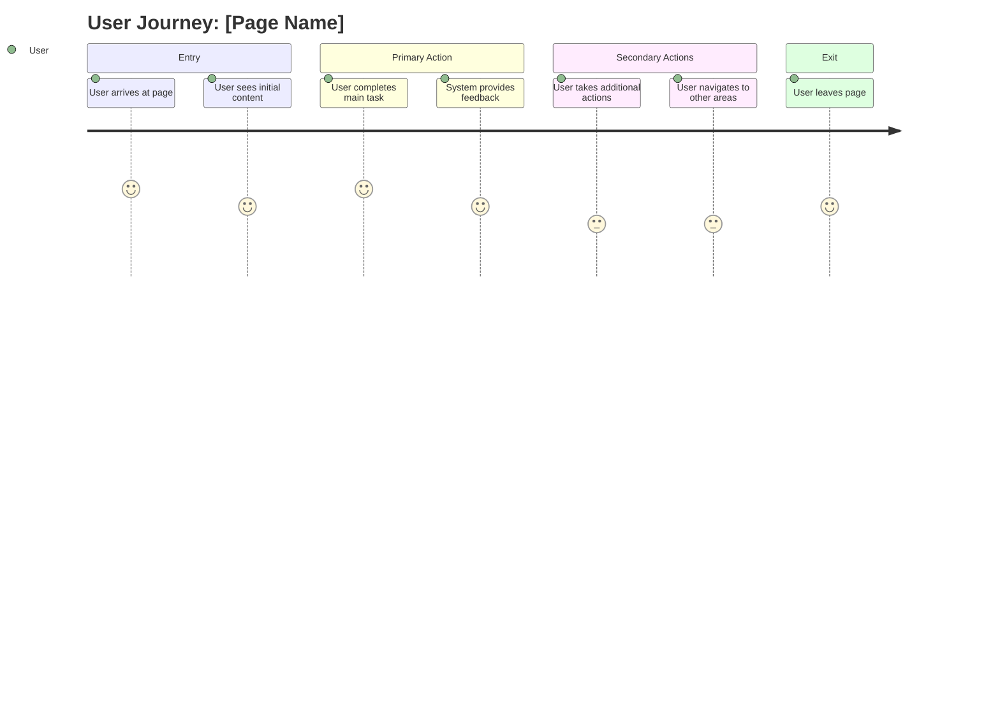

# [Page Name] Page Design

**Purpose**: This document provides the core user experience and layout understanding for the [Page Name] page to guide implementation planning.

## 1. Page Purpose & User Experience

Define the page's role and primary user experience goals.

**Format**:

- **Primary Purpose**: [Core business objective and user need this page addresses]
- **User Journey Position**: [Where this page fits in the overall user flow]
- **Key User Actions**: [Main actions users need to accomplish on this page]

**Example**:

- **Primary Purpose**: Allow users to securely authenticate and access their personalized dashboard
- **User Journey Position**: Entry point for authenticated users, gateway to main application features
- **Key User Actions**: Login, password recovery, account creation

## 2. Page Layout & Visual Structure

Define the core layout and visual hierarchy of the page.

**Format**:

### Wireframe Reference

### Layout Structure

- **Header Section**: [Navigation, branding, user controls]
- **Main Content Area**: [Primary content and functionality]
- **Sidebar/Secondary Content**: [Supporting information or navigation]
- **Footer Section**: [Additional links, legal information, contact details]

### Visual Hierarchy

- **Primary Focus**: [Main user action or most important content]
- **Secondary Elements**: [Supporting content and actions]
- **Tertiary Information**: [Additional details and context]

### Major Interactions (if applicable)

## 3. Component Usage & Consistency

Define key components used and how this page relates to existing patterns.

**Format**:

### Key Components

- **Navigation**: [Primary navigation and breadcrumb usage]
- **Content Areas**: [Cards, tables, lists for content organization]
- **Interactive Elements**: [Buttons, forms, modals for user actions]
- **Feedback Elements**: [Loading, error, success states]

### Consistency with Existing Pages

- **Similar Pages**: [Which existing pages this should be consistent with]
- **Reused Patterns**: [Components and layouts borrowed from other pages]
- **New Elements**: [Any new components or patterns needed]

## 4. User Experience Flow

Define the primary user journey and key interactions on this page.

**Format**:

### User Journey Flow

**Note**: Customize the journey sections, task names, and satisfaction scores (1-5) to match your specific page. See [Mermaid User Journey syntax](https://mermaid.js.org/syntax/userJourney.html) for details.

### Primary User Journey

1. **Entry Point**: [How users arrive at this page]
2. **Initial State**: [What users see when they first land]
3. **Primary Action**: [Main user action and expected outcome]
4. **Secondary Actions**: [Additional actions users can take]
5. **Exit Points**: [How users leave this page and where they go]

### Key Interactions

- **Primary Interactions**: [Main user actions and their outcomes]
- **Secondary Interactions**: [Additional actions and navigation]
- **Error Handling**: [How errors are communicated and resolved]

## 5. Responsive Behavior

Define how the page adapts across different screen sizes.

**Format**:

### Layout Flow Patterns

#### Mobile-First Flow

- **Content Stacking**: [How content stacks vertically on narrow screens]
- **Touch Optimization**: [Touch target sizing and gesture support]

#### Desktop Enhancement Flow

- **Content Distribution**: [How content spreads horizontally on wider screens]
- **Hover Interactions**: [Mouse hover states and interactions]

### Cross-Device Consistency

- **Unified Experience**: [How the same functionality works across all devices]
- **Progressive Enhancement**: [Core functionality that works everywhere, enhanced features for capable devices]
