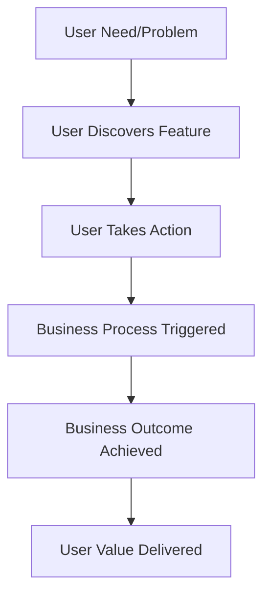

# Feature: [Feature Name] - Technical Design

**Purpose**: This document provides the high-level technical specifications for the [Feature Name] feature. It includes a technical overview, system flow, and integration points with existing architecture.

## 1. Feature Overview

Provide a 1-2 paragraph summary of the feature's business purpose and user value. Describe the user problem being solved, the business impact, and the expected outcomes. Include:

- **Business Purpose**: [One-sentence description of the business value and user benefit]
- **User Problem**: [What user pain point or need does this feature address?]
- **Business Impact**: [What business outcomes will this feature deliver?]
- **Success Metrics**: [How will we measure the success of this feature?]

## 2. System / User Flow

Illustrate the user journey and business workflow for this feature. Use a Mermaid diagram for clarity. The diagram should show:

- **User Journey**: [How users interact with the feature from start to finish]
- **Business Process**: [What business process or workflow this feature supports]
- **User Decision Points**: [Where users make decisions or take actions]
- **Business Outcomes**: [What business results are achieved at each step]



## 3. Change Summary Table

**Purpose**: Provide a comprehensive overview of all code changes required to implement this feature. This table serves as the single source of truth for what needs to be built, modified, or removed.

**How to Populate**:

- **Module/File Path**: Use exact file paths relative to project root (e.g., `src/components/UserProfile.tsx`)
- **Item Name**: Specific function, component, type, or module name being created/modified
- **Status**: `New` (creating from scratch), `Updated` (modifying existing), `Removed` (deleting)
- **Description**: Brief explanation of what this change accomplishes and why it's needed

**Validation Requirements**:

- Every item must have a corresponding detailed specification in Implementation Details
- No duplicate entries for the same file/function
- All changes must trace back to test scenarios and business requirements
- Status must accurately reflect the actual change being made

| Module/File Path    | Item Name    | Status                  | Description                                           |
| :------------------ | :----------- | :---------------------- | :---------------------------------------------------- |
| `[path/to/file.ts]` | `[ItemName]` | `[New/Updated/Removed]` | `[What this change accomplishes and why it's needed]` |

## 4. Implementation Details

**Purpose**: Provide detailed specifications for each item listed in the Change Summary Table. Focus on WHAT needs to be built and WHY it's needed, not HOW to implement it.

**Documentation Standards**:

- **What**: Clearly describe what the component/function does and its responsibilities
- **Why**: Explain the business purpose and technical rationale for this implementation
- **Interface**: Define the public API, parameters, and return types
- **Dependencies**: List what other components/modules this depends on
- **Constraints**: Note any architectural, performance, or security constraints

**Format**: Organize by module/file, then by component/function within each module.

### 4.1. `[ModuleName]` Module (`[path/to/module.ts]`)

**Module Purpose**: [What this module is responsible for and why it exists]
**Module Dependencies**: [What other modules this depends on and why]
**Business Context**: [The business WHY behind the module's existence]
**Integration Points**: [How it connects with other parts of the system]

#### Components/Functions in this Module:

##### `[ComponentName]` Component/Function: `[InterfaceName]` → `[ReturnType]`

- **What**: [What this component/function does and its primary responsibility]
- **Why**: [Business purpose and technical rationale for this component/function]
- **Constraints**: [Any architectural, performance, or security constraints]
- **Integration Points**: [How this connects with other parts of the system]

##### `[AnotherComponentName]` Component/Function: `[InterfaceName]` → `[ReturnType]`

- **What**: [What this component/function does and its primary responsibility]
- **Why**: [Business purpose and technical rationale for this component/function]
- **Constraints**: [Any architectural, performance, or security constraints]
- **Integration Points**: [How this connects with other parts of the system]

## 5. Test Scenarios (Gherkin)

**Purpose**: Define comprehensive test scenarios that validate complete user workflows and business outcomes. These scenarios serve as executable specifications that ensure the feature meets all business requirements.

**Documentation Pattern**: Use the following structure to organize test scenarios:

### 5.1. Scenario Organization

- **Test Modules**: Group related scenarios using `TSM#` identifiers with descriptive names
- **Scenario Numbers**: Each scenario must have unique `TS#` identifier (TS001, TS002, etc.)
- **Tagging System**: Apply appropriate tags for categorization and status tracking
- **Status Tracking**: All scenarios must include `@status_pending` tag for implementation tracking

### 5.2. Documentation Structure

```gherkin
Feature: [Feature Name]

  #---------------------------------------------------------------------------
  # TSM001: [Test Module Name - Descriptive Business Context]
  #---------------------------------------------------------------------------

  @TS001 @happyPath @status_pending
  Scenario: [Describe complete user workflow with business outcome]
    Given [specific business context and preconditions]
    When [user performs business action]
    Then [specific business outcome is achieved]
    And [additional business validations]
    And [user experience confirmations]

  @TS002 @errorPath @status_pending
  Scenario: [Describe business error condition and recovery]
    Given [business context that leads to error]
    When [user action that triggers error]
    Then [specific error message is displayed]
    And [user remains in appropriate state]
    And [recovery options are available]

  #---------------------------------------------------------------------------
  # TSM002: [Another Test Module - Different Business Context]
  #---------------------------------------------------------------------------

  @TS003 @happyPath @status_pending
  Scenario: [Another complete user workflow]
    Given [business preconditions]
    When [user business action]
    Then [business outcomes]
    And [user experience validations]
```
