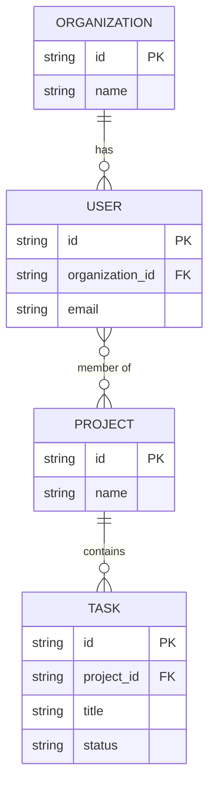

# 03 - Data Model Template

**Purpose**: This document details the persisted data model for the application, including entities, their attributes, relationships, and constraints. It focuses solely on the data structure and relationships independent of access patterns or user experience. This serves as the single source of truth for the application's persisted data structure.

## 1. Core Entities

[Define the primary data entities that form the backbone of your application's domain.]

**Format**:

- **[Entity Name]**: [A brief, one-sentence description of the entity's purpose]

**Example**:

- **User**: Represents an individual with an account who can log in and access the system
- **Organization**: Represents a company or team that users belong to
- **Project**: Represents a container for tasks and resources within an organization
- **Task**: Represents a single unit of work to be completed within a project

## 2. Entity Schema Definitions

[Provide detailed breakdown of attributes for each entity, including data types, constraints, and descriptions.]

**Format**:

### [Entity Name]

| Attribute Name     | Data Type     | Constraints                             | Description                              |
| ------------------ | ------------- | --------------------------------------- | ---------------------------------------- |
| `id`               | `UUID`        | Primary Key, Not Null                   | Unique identifier for the entity         |
| `[attribute_name]` | `[data_type]` | `[e.g., Not Null, Unique, Foreign Key]` | `[Purpose of the attribute]`             |
| `created_at`       | `Timestamp`   | Not Null                                | Timestamp of when the record was created |
| `updated_at`       | `Timestamp`   | Not Null                                | Timestamp of the last update             |

**Example**:

### Task

| Attribute Name | Data Type                             | Constraints                        | Description                              |
| -------------- | ------------------------------------- | ---------------------------------- | ---------------------------------------- |
| `id`           | `UUID`                                | Primary Key, Not Null              | Unique identifier for the task           |
| `project_id`   | `UUID`                                | Foreign Key (Project.id), Not Null | The project this task belongs to         |
| `title`        | `String(255)`                         | Not Null                           | The title or name of the task            |
| `status`       | `Enum('todo', 'in-progress', 'done')` | Not Null, Default: 'todo'          | The current status of the task           |
| `due_date`     | `Date`                                | Nullable                           | The target completion date for the task  |
| `created_at`   | `Timestamp`                           | Not Null                           | Timestamp of when the record was created |
| `updated_at`   | `Timestamp`                           | Not Null                           | Timestamp of the last update             |

## 3. Entity-Relationship Diagram (ERD)

[Provide a diagram illustrating entities and their relationships using Mermaid syntax. Only include keys needed for entity relationships, not all attributes from the tables above.]

**Example (Mermaid Syntax)**:

## 4. Data Constraints & Business Rules

[Capture the critical guardrails that keep the data model healthy and compliant. Focus on concise bullets instead of long prose.]

- **Entity Constraints**: [Required fields, type limits, cardinality rules]
- **Business Rules**: [Domain-specific validations enforced at the data level]
- **Security & Privacy**: [Sensitive data handling, encryption, retention, access control]
