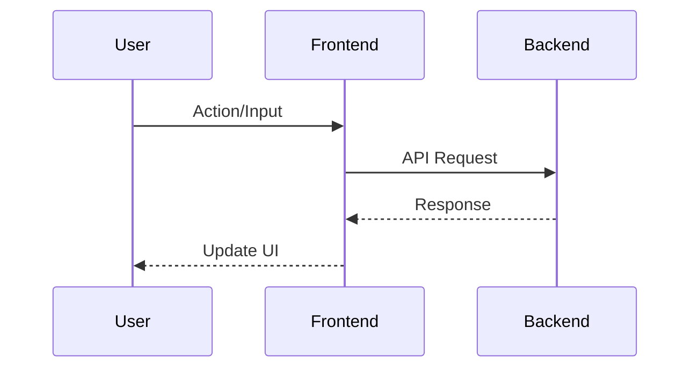
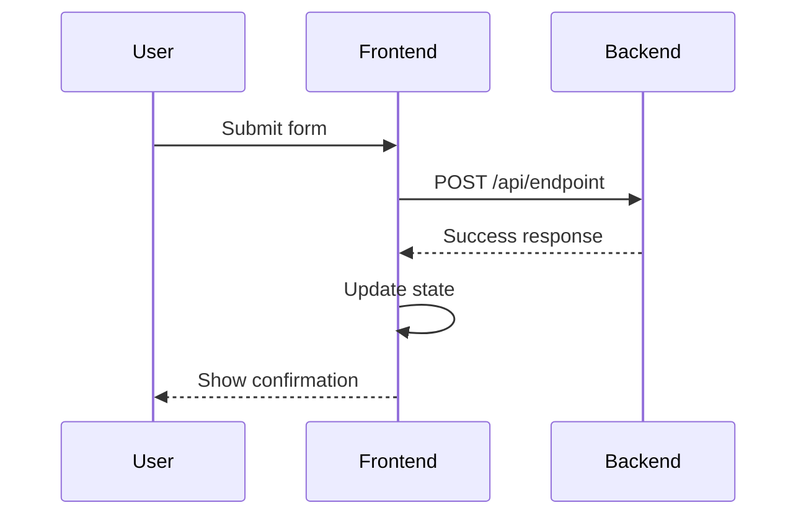

# Feature: [Feature Name] - Technical Design

**Purpose**: This document provides the high-level technical specifications for the [Feature Name] feature. It includes a technical overview, system flow, and integration points with existing architecture.

## 1. Feature Overview

Provide a 1-2 paragraph summary of the feature's business purpose and user value. Describe the user problem being solved, the business impact, and the expected outcomes. Include:

- **Business Purpose**: [One-sentence description of the business value and user benefit]
- **User Problem**: [What user pain point or need does this feature address?]
- **Business Impact**: [What business outcomes will this feature deliver?]
- **Success Metrics**: [How will we measure the success of this feature?]

## 2. User Journey

**Purpose**: Show the technical flow of user interactions with the system, including how the frontend communicates with the backend. Use a Mermaid sequence diagram to illustrate the step-by-step interactions between user, frontend, and backend.

**How to Populate**:

- Show clear interactions between User → Frontend → Backend → Frontend → User
- Include all key user actions and system responses
- Show API calls, data flow, and UI updates
- Keep diagrams compact and focused on the feature's core flow
- Add additional participants (e.g., Database, External Service) only if critical to understanding the flow

**Mermaid Sequence Diagram Syntax**:

**Example**:

