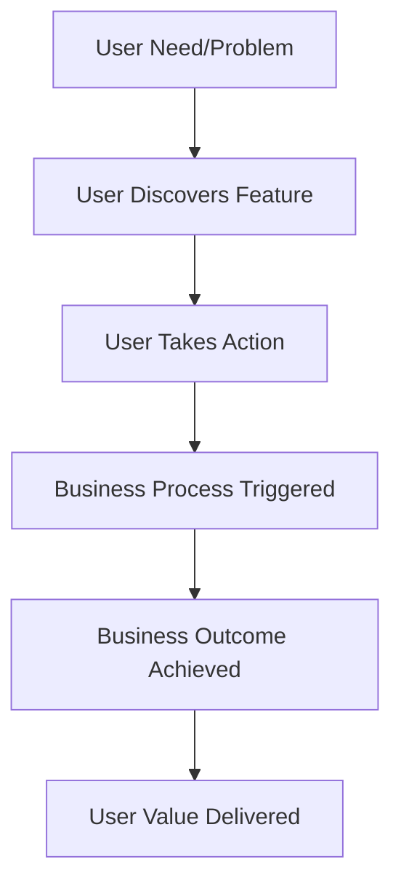

# Feature: [Feature Name] - Technical Design

**Purpose**: This document provides the high-level technical specifications for the [Feature Name] feature. It includes a technical overview, system flow, and integration points with existing architecture.

## 1. Feature Overview

Provide a 1-2 paragraph summary of the feature's business purpose and user value. Describe the user problem being solved, the business impact, and the expected outcomes. Include:

- **Business Purpose**: [One-sentence description of the business value and user benefit]
- **User Problem**: [What user pain point or need does this feature address?]
- **Business Impact**: [What business outcomes will this feature deliver?]
- **Success Metrics**: [How will we measure the success of this feature?]

## 2. System / User Flow

Illustrate the user journey and business workflow for this feature. Use a Mermaid diagram for clarity. The diagram should show:

- **User Journey**: [How users interact with the feature from start to finish]
- **Business Process**: [What business process or workflow this feature supports]
- **User Decision Points**: [Where users make decisions or take actions]
- **Business Outcomes**: [What business results are achieved at each step]

