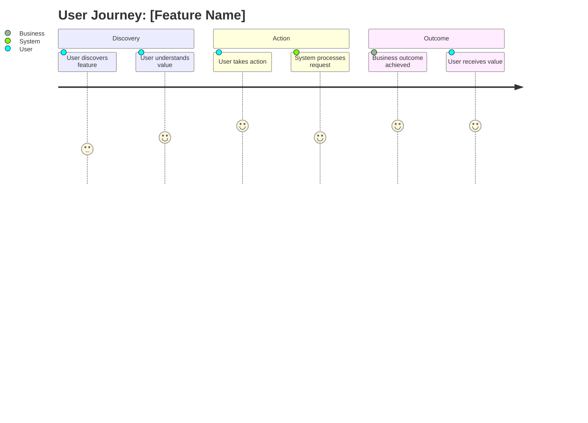

# Feature: [Feature Name] - Technical Design

**Purpose**: This document provides the high-level technical specifications for the [Feature Name] feature. It includes a technical overview, system flow, and integration points with existing architecture.

## 1. Feature Overview

Provide a 1-2 paragraph summary of the feature's business purpose and user value. Describe the user problem being solved, the business impact, and the expected outcomes. Include:

- **Business Purpose**: [One-sentence description of the business value and user benefit]
- **User Problem**: [What user pain point or need does this feature address?]
- **Business Impact**: [What business outcomes will this feature deliver?]
- **Success Metrics**: [How will we measure the success of this feature?]

## 2. User Journey

**Purpose**: Show the user's experience and business workflow from a user perspective. Use user journey diagram to illustrate user emotions, touchpoints, and business outcomes.

**How to Populate**:

- Focus on user experience stages and emotions
- Show key touchpoints and decision points
- Indicate business outcomes at each stage

