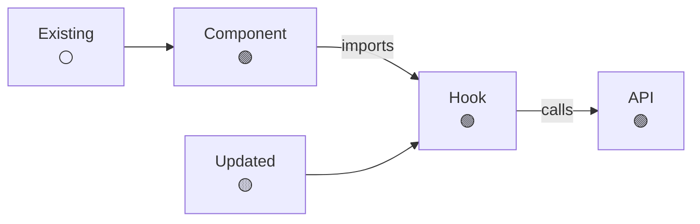
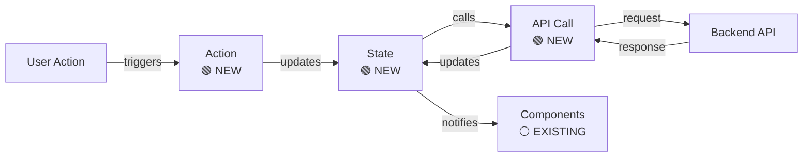
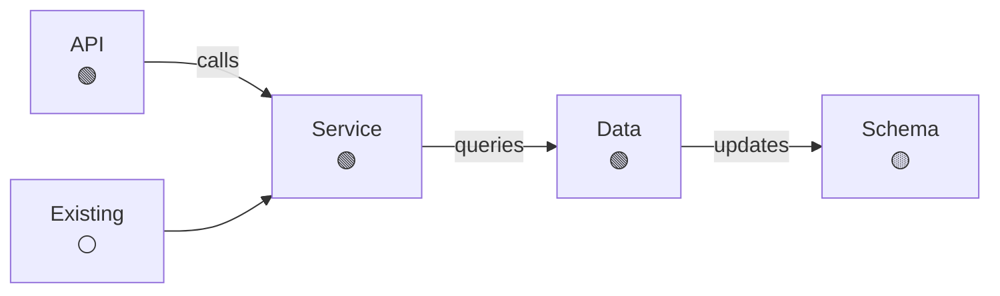

# Feature: [Feature Name] - Technical Design

**Purpose**: This document provides the high-level technical specifications for the [Feature Name] feature. It includes a technical overview, system flow, and integration points with existing architecture.

## 1. Feature Overview

<!-- ALREADY POPULATED by 201-High-Level-Design workflow -->

## 2. User Journey

<!-- ALREADY POPULATED by 201-High-Level-Design workflow -->

## 2.5. Component Architecture

**Purpose**: Visual overview of component relationships, state flow, and module dependencies to help reviewers understand how components connect and what is changing.

### 2.5.1. Frontend Component Dependencies

**Purpose**: Shows relationships between frontend UI components, hooks, and utility modules. Use component dependency graph to illustrate imports, composition, and data flow.

**How to Populate**:

- Include all frontend components, hooks, and modules from Frontend Change Summary Table (exclude style modules from diagram)
- Use arrows to show dependencies (imports, uses, calls)
- Annotate with status: 🟢 NEW, 🟡 UPDATED, ⚪ EXISTING
- Group related components when helpful
- Keep diagrams compact and focused

### 2.5.2. Frontend State Flow

**Purpose**: Shows state management flow including state structure, actions, reducers/selectors, and state transitions. Use state flow diagram to illustrate how state changes propagate through the system. **Stop at the backend boundary** - show API calls and data returns, but do not show backend internals.

**How to Populate**:

- Include all state-related changes from Frontend Change Summary Table
- Show state structure, actions, and state transitions
- Indicate data flow direction
- Show API calls to backend and data returns, but stop at backend boundary (do not show backend internals)
- Annotate with status: 🟢 NEW, 🟡 UPDATED, ⚪ EXISTING
- Keep diagrams compact and focused

### 2.5.3. Backend Module Dependencies

**Purpose**: Shows relationships between backend modules, services, API handlers, and data access layers. Use module dependency graph to illustrate service dependencies, API routes, and data flow.

**How to Populate**:

- Include all backend modules, services, and handlers from Backend Change Summary Table
- Use arrows to show dependencies (imports, calls, queries)
- Annotate with status: 🟢 NEW, 🟡 UPDATED, ⚪ EXISTING
- Show data flow from API → Service → Data layer
- Keep diagrams compact and focused

## 3. Frontend Change Summary Table

**Purpose**: Provide a comprehensive overview of all frontend code changes required to implement this feature. This table serves as the single source of truth for what needs to be built, modified, or removed.

**How to Populate**:

- **Module/File Path**: Use exact file paths relative to project root (e.g., `src/components/UserProfile.tsx`)
- **Item Name**: Specific function, component, type, or module name being created/modified
- **Status**: `New` (creating from scratch), `Updated` (modifying existing), `Removed` (deleting)
- **Description**: Brief explanation of what this change accomplishes and why it's needed

**Validation Requirements**:

- Every item must have a corresponding detailed specification in Frontend Implementation Details **EXCEPT** style modules (CSS, SCSS, style files) which should be listed here but not detailed in Implementation Details
- No duplicate entries for the same file/function
- All changes must trace back to test scenarios and business requirements
- Status must accurately reflect the actual change being made

| Module/File Path    | Item Name    | Status                  | Description                                           |
| :------------------ | :----------- | :---------------------- | :---------------------------------------------------- |
| `[path/to/file.ts]` | `[ItemName]` | `[New/Updated/Removed]` | `[What this change accomplishes and why it's needed]` |

## 4. Backend Change Summary Table

**Purpose**: Provide a comprehensive overview of all backend code changes required to implement this feature. This table serves as the single source of truth for what needs to be built, modified, or removed.

**How to Populate**:

- **Module/File Path**: Use exact file paths relative to project root (e.g., `src/server/api/endpoint.ts`)
- **Item Name**: Specific function, component, type, or module name being created/modified
- **Status**: `New` (creating from scratch), `Updated` (modifying existing), `Removed` (deleting)
- **Description**: Brief explanation of what this change accomplishes and why it's needed

**Validation Requirements**:

- Every item must have a corresponding detailed specification in Backend Implementation Details
- No duplicate entries for the same file/function
- All changes must trace back to test scenarios and business requirements
- Status must accurately reflect the actual change being made

| Module/File Path    | Item Name    | Status                  | Description                                           |
| :------------------ | :----------- | :---------------------- | :---------------------------------------------------- |
| `[path/to/file.ts]` | `[ItemName]` | `[New/Updated/Removed]` | `[What this change accomplishes and why it's needed]` |

## 5. Frontend Implementation Details

**Purpose**: Provide interface specifications, purpose, and constraints for each item listed in the Frontend Change Summary Table. Focus on WHAT needs to be built and WHY it's needed, not HOW to implement it.

**Note**: Style modules (CSS, SCSS, style files) listed in the Frontend Change Summary Table should NOT be detailed here - they are tracked in the summary table only.

### `[path/to/module.ts]`

[What this module is responsible for and why it exists]

#### `[functionName](params: Type) => ReturnType`

- _Purpose_: [What this component/function does and why it's needed]
- _Constraints_: [Any architectural, performance, or security constraints]
- _Implementation Details_: [Optional - only include for complex scenarios and business rules]

#### `[anotherFunctionName](params: Type) => ReturnType`

- _Purpose_: [What this component/function does and why it's needed]
- _Constraints_: [Any architectural, performance, or security constraints]

## 6. Backend Implementation Details

**Purpose**: Provide interface specifications and constraints for each item listed in the Backend Change Summary Table. Focus on WHAT needs to be built and WHY it's needed, not HOW to implement it.

### `[path/to/module.ts]`

[What this module is responsible for and why it exists]

#### `[functionName](params: Type) => ReturnType`

- _Purpose_: [What this component/function does and why it's needed]
- _Constraints_: [Any architectural, performance, or security constraints]
- _Implementation Details_: [Optional - only include for complex scenarios and business rules]

#### `[anotherFunctionName](params: Type) => ReturnType`

- _Purpose_: [What this component/function does and why it's needed]
- _Constraints_: [Any architectural, performance, or security constraints]

## 7. Test Scenarios (Gherkin)

<!-- ALREADY POPULATED by 202-Test-Scenario-Design workflow -->
